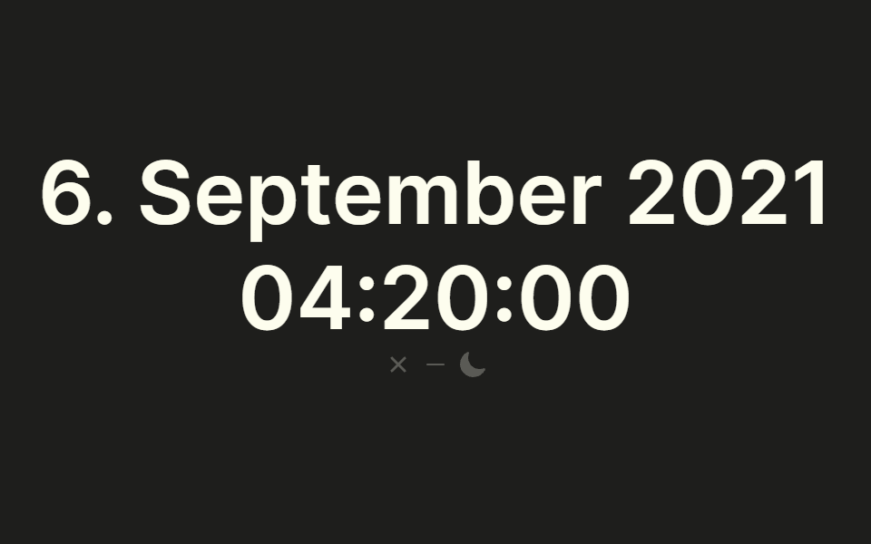

# Time.

## Screenshot

<div align="center">
  
</div>

## Description

Minimalistic App to display the current Time.
Currently only supporting Windows

## Todo

- [ ] MacOS support
- [ ] Spectron tests (Spectron doesn't support Electron 15 yet)
- [ ] Persist Dark-/lightmdoe

## Development

Install dependencies

```bash
npm i
```

Start App in development mode

```bash
npm run dev
```

Bundle App into binaries

```bash
npm run bundle
```

## Package scripts

- `npm run dev` Start App in dev mode
- `npm run bundle` Bundle App into binaries
- `npm run lint` Lint App
